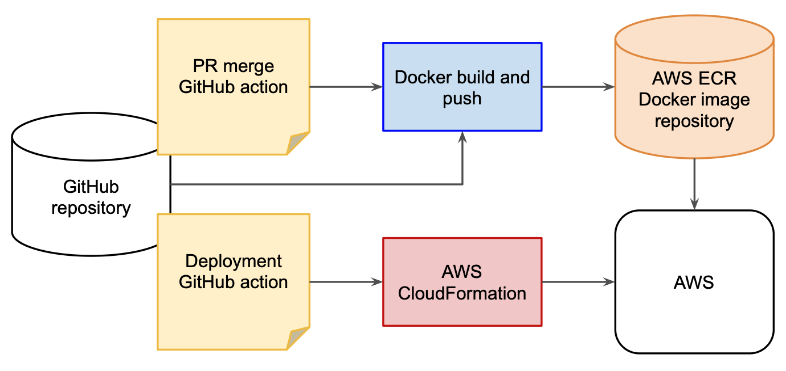
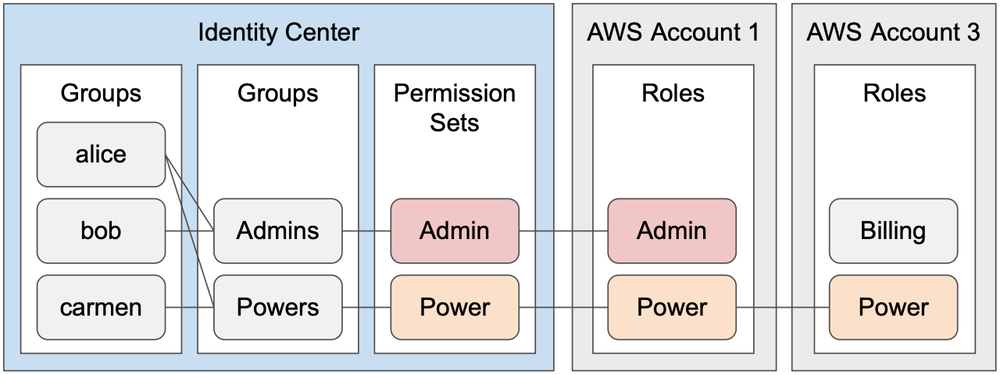

# Infrastructure

This directory contains scripts and AWS CloudFormation templates for building and deploying the math app.

## Overview

The Continuous Integration/Continuous Deployment pipeline is comprised of a GitHub action for building and pushing Docker images when a Pull Request is merged to the main branch, and another GitHub action for deploying CloudFormation stacks.



## CloudFormation Templates

The following templates are provided:
  - `ecr.yml`: Private ECR repository for Docker images
  - `github-roles.yml`: AWS IAM OIDC roles for GitHub Actions to access AWS resources during build and deployment.

## Tools

The build and deployment actions can be run from a local development environment by installing GNU Make, AWS CLI, and an OCI-compatible tool suite for building and running container images such as [Podman](https://podman.io) or [Docker](https://docs.docker.com/desktop/setup/install).

Mac OS:
  - `xcode-select --install`
  - `/bin/bash -c "$(curl -fsSL https://raw.githubusercontent.com/Homebrew/install/HEAD/install.sh)"`
  - `brew install awscli`

Linux (Ubuntu or derivatives):
  - `sudo apt update`
  - `sudo apt install make`
  - `sudo apt install awscli`

Windows:
  - [Chocolatey](https://chocolatey.org/install)
  - `choco install make`

## AWS Authentication

The scripts and GitHub actions here rely on OpenID Connect (OIDC) authentication when running as GitHub actions, and AWS SSO when running in local development environments.

### GitHub Actions

We use OIDC to let GitHub actions assume AWS IAM roles based on the organization, repository, and optionally also the branch the action is running from.

The IAM roles for OIDC are managed and deployed with the `github-roles.yaml` CloudFormation template, and access to roles is granted in GitHub actions by calling the official AWS [`configure-aws-credentials`](https://github.com/aws-actions/configure-aws-credentials) action.

### Local Development

AWS SSO is currently the best way to get access to AWS resources from the command line. This method uses short-lived tokens obtained via login on an AWS web page, rather than storing long-lived tokens on your local file system or in environment variables.

You'll need an AWS config file (default location `~/.aws/config`) with a session and profile. For example:

```
[sso-session burgaard]
sso_start_url = https://<AWS app ID>.awsapps.com/start#
sso_region = us-west-2
sso_registration_scopes = sso:account:access

[profile math-app]
sso_session = burgaard
sso_account_id = <AWS account ID>
sso_role_name = AdministratorAccess
```

See [here](https://docs.aws.amazon.com/singlesignon/latest/userguide/howtogetcredentials.html) for more details about setting up IAM Identity Center and provisioning users with access to AWS accounts.

With IdC, users and permissions are managed centrally. Rather than logging in to each AWS account with credentials, users log in to their central user then assume a role they have been granted access to in the target AWS account.



### Environment Variables

The following environment variables must be defined in an `.env` file or exported in your shell when running locally:
  - `AWS_REGION`: The AWS region to deploy to. This must be a valid AWS region, e.g. `us-east-1`.
  - `AWS_PROFILE`: The AWS profile to use when running AWS CLI commands. This value needs to match the name of a profile in your `~/.aws/config`.
  - `AWS_SSO_SESSION`: The AWS SSO session to use when logging in via the CLI. This value needs to match the name of an sso-session in your `~/.aws/config`.
  - `DATABASE_URL`: The URL to the database. Typically set to `file:./dev.db`
  - `GITHUB_REPOSITORY`: The name of the GitHub owner and repository to use for OIDC. E.g. `burgaard/math-app`

Optionally you can also set the following variables:
  - `CONTAINER_CLI`: The name of the CLI tool to manipulate container images. Defaults to `docker`.
  - `GITHUB_BRANCH`: The name of the branch to restrict writes and deployments. Defaults to `main` and can be disabled by specifying `*`.

## Build

The container images can be built locally by running `make build` and pushed to ECR by running `make push`. The latter should only be run to test and debug the CI/CD pipeline, as it will potentially overwrite images created by PR merges and thus potentially break consistency between tagged release baselines in the source repository and the corresponding container image builds.

## Deploy

**WARNING**: Deploying CloudFormation templates will result in creation of AWS resources that incur charges and/or consume AWS credits. Any changes to your AWS accounts including increased operating costs is entirely at your own risk. Do not run any commands or use any of the CloudFormation templates in this directory if you are not comfortable with assuming all responsibility for the consequences of doing so.

Run `make` to create or update all CloudFormation templates. CloudFormation will automatically update AWS resources when their CloudFormation definitions have changed.
